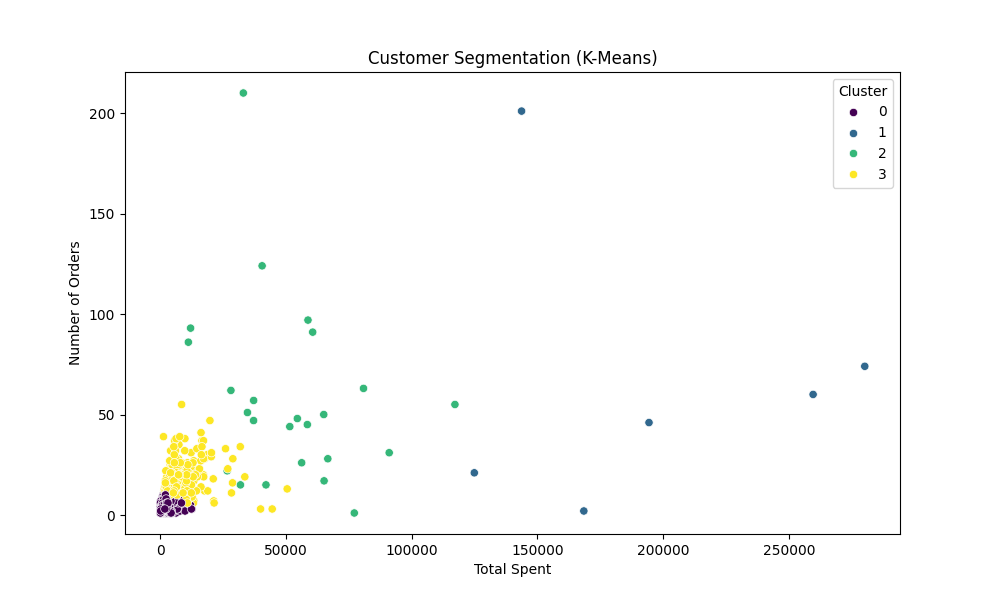

# Customer Segmentation Project

This project aims to segment customers based on their purchasing behavior using various clustering techniques.

## Dataset

The dataset used is the [Online Retail Dataset](https://archive.ics.uci.edu/ml/datasets/Online+Retail) from the UCI Machine Learning Repository.

## Data Preprocessing

The data was cleaned and preprocessed by:
- Removing rows with missing values
- Removing duplicate entries
- Filtering out canceled orders
- Creating a `TotalPrice` feature

## Clustering Techniques

### K-Means Clustering

K-Means clustering was applied to segment customers into 4 clusters. The Elbow Method was used to determine the optimal number of clusters.

### Hierarchical Clustering

Hierarchical Clustering was also applied. The Dendrogram helped visualize the clusters.

### DBSCAN

DBSCAN was another technique used for clustering.

## Results

The clusters were analyzed to understand the characteristics of each customer segment.

### K-Means Cluster Summary

| KMeans_Cluster | CustomerID   | TotalSpent   | NumberOfOrders | TotalQuantity |
|----------------|--------------|--------------|----------------|---------------|
| 0              | 15304.960626 | 977.257050   | 2.803887       | 587.803635    |
| 1              | 15661.666667 | 195225.385000| 67.333333      | 95124.166667  |
| 2              | 15019.500000 | 51579.120833 | 57.416667      | 34548.583333  |
| 3              | 15255.717579 | 7510.274496  | 16.268012      | 4141.489914   |

### Hierarchical Clustering Summary

| HC_Cluster | CustomerID   | TotalSpent    | NumberOfOrders | TotalQuantity | KMeans_Cluster |
|------------|--------------|---------------|----------------|---------------|----------------|
| 0          | 15249.818182 | 136028.880000 | 37.454545      | 78063.363636  | 1.545455       |
| 1          | 15294.440905 | 1143.356903   | 3.105302       | 686.946741    | 0.109436       |
| 2          | 15011.214286 | 49351.888571  | 91.071429      | 28732.428571  | 1.928571       |
| 3          | 15434.554455 | 9893.471238   | 20.198020      | 5347.574257   | 2.975248       |

### DBSCAN Clustering Summary

| DBSCAN_Cluster | CustomerID   | TotalSpent    | NumberOfOrders | TotalQuantity | KMeans_Cluster | HC_Cluster |
|----------------|--------------|---------------|----------------|---------------|----------------|------------|
| -1             | 14963.276316 | 41914.264079  | 37.934211      | 24156.368421  | 2.486842       | 2.118421   |
| 0              | 15305.260277 | 1315.236141   | 3.635189       | 768.466291    | 0.208598       | 1.072821   |
| 1              | 15787.333333 | 17127.428333  | 29.666667      | 9773.500000   | 3.000000       | 3.000000   |

## How to Run

1. Clone the repository.
2. Install the required packages using `pip install -r requirements.txt`.

## Conclusion

This project successfully segmented customers based on their purchasing behavior using multiple clustering techniques.

## License

This project is licensed under the MIT License.
